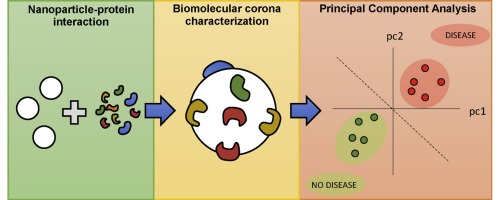

## Principal component analysis (PCA)
### with High-order Local Auto-Correlation (HLAC)

### - 프로젝트 목표 
1. 양품/불량 이미지를 High-order Local Auto-Correlation(HLAC)를 통해 고차원의 Data를 얻는다 
2. 추출한 Data 를 Principal component analysis(PCA)를 통해 분석한다
3. 분석된 Data를 통해 양품/불량을 나눌수 있는지 증명한 뒤, 해당 logic을 통해 프로그램을 제작한다.

### - 프로젝트 효용성
1. AI 검사를 위한 이미지 학습(양/불)을 Skip 할 수 있어 AI 학습을 위한 업무 Load 개선
2. 범용 모델을 대상으로 한 AI 검사 Program 제작 가능성 제시

### - 미리 공부해야 할 내용
1. <a href="https://rest-term.com/archives/2889/">HLAC 이론</a>
2. <a href="https://github.com/search?q=hlac">HLAC code</a>
3. <a href="https://www.youtube.com/watch?v=YEdscCNsinU&t=626s"> PCA 이론(유튜브)</a>
4. <a href="https://www.youtube.com/watch?v=FhQm2Tc8Kic"> PCA 이론(유튜브) & code</a>
5. <a href="https://www.inflearn.com/courses?s=opencv">open cv</a>

### - 날짜별 진행 목표